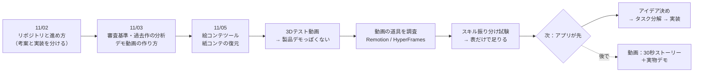
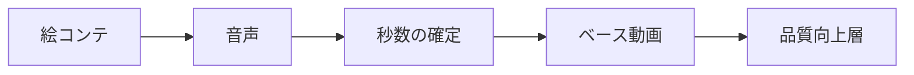

# 設計と考えの流れ

日付ごとに、何を考えて何を決めたか。詳しくは [decisions.md](decisions.md) と [log/](log/)。
GitHub ではこのまま図として表示される。

```mermaid
flowchart LR
  A["11/02<br>リポジトリと進め方<br>（考案と実装を分ける）"] --> B["11/03<br>審査基準・過去作の分析<br>デモ動画の作り方"]
  B --> C["11/05<br>絵コンテツール<br>紙コンテの復元"]
  C --> D["3Dテスト動画<br>→ 製品デモっぽくない"]
  D --> E["動画の道具を調査<br>Remotion / HyperFrames"]
  E --> F["スキル振り分け試験<br>→ 表だけで足りる"]
  F --> G{"次：アプリが先"}
  G --> H["アイデア決め<br>→ タスク分解 → 実装"]
  G -.後で.-> I["動画：30秒ストーリー<br>＋実物デモ"]
```

## 動画を作る順（idea/demo-video-pipeline.md より）

```mermaid
flowchart LR
  s1[絵コンテ] --> s2[音声] --> s3[秒数の確定] --> s4[ベース動画] --> s5[品質向上層]
```
